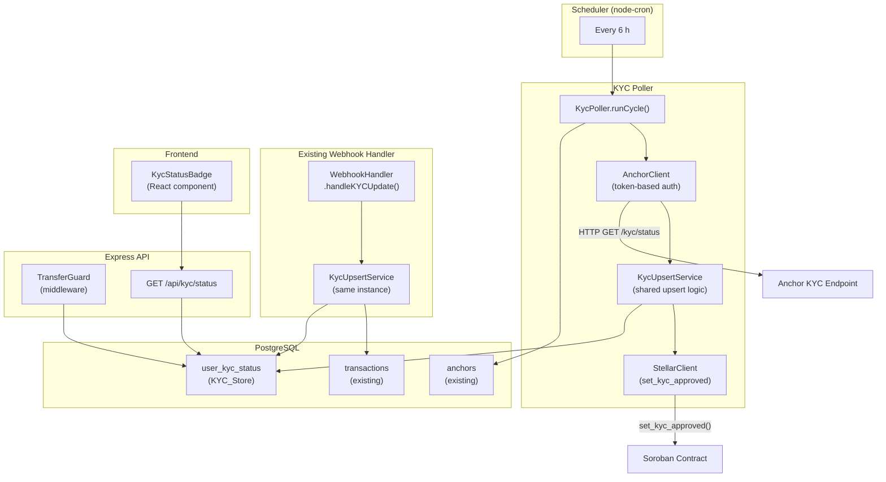

# Design Document: KYC Verification Sync Service

## Overview

The KYC Verification Sync Service adds a dedicated, polling-based KYC status layer to SwiftRemit. It closes the gap between infrequent webhook events by actively querying each anchor's KYC endpoint on a schedule, persisting results in a new `user_kyc_status` table, and enforcing KYC approval as a hard gate at the backend API boundary before any transfer reaches the Soroban smart contract.

The service is composed of five collaborating components:

1. **KYC_Store** – a new `user_kyc_status` PostgreSQL table (one row per user/anchor pair).
2. **KYC_Poller** – a cron job registered in the existing `scheduler.ts` that drives polling.
3. **Anchor_Client** – an HTTP client that calls each anchor's KYC endpoint with token-based auth.
4. **KYC_Upsert_Service** – shared business logic used by both the poller and the existing webhook handler.
5. **Transfer_Guard** – Express middleware that queries the KYC_Store before forwarding transfer requests.
6. **KYC_API** – a `GET /api/kyc/status` REST endpoint consumed by the frontend.

---

## Architecture



### Key Design Decisions

- **Shared upsert service**: Both the poller and the webhook handler call the same `KycUpsertService.upsert()` method. This guarantees identical write semantics regardless of update source and satisfies Requirement 6.2.
- **Error isolation**: Each anchor is polled inside its own try/catch. A failure for one anchor never aborts the cycle (mirrors the existing `revalidateStaleAssets` pattern in `scheduler.ts`).
- **Defence-in-depth**: The `TransferGuard` middleware enforces KYC at the API layer independently of the on-chain `confirm_kyc` guard in the Soroban contract.
- **Last-write-wins**: The upsert uses `verified_at` as the conflict-resolution timestamp so the most recent update always wins, regardless of whether it came from a webhook or a poll.

---

## Components and Interfaces

### KycUpsertService (`backend/src/kyc-upsert-service.ts`)

Shared service used by both the poller and the webhook handler.

```typescript
export interface KycRecord {
  user_id: string;
  anchor_id: string;
  kyc_status: 'pending' | 'approved' | 'rejected';
  kyc_level?: 'basic' | 'intermediate' | 'advanced';
  rejection_reason?: string;
  verified_at: Date;
  expires_at?: Date;
}

export class KycUpsertService {
  constructor(private pool: Pool) {}

  /** Upsert a KYC record; last verified_at wins on conflict. */
  async upsert(record: KycRecord): Promise<void>;

  /** Query the most favourable status for a user across all anchors. */
  async getStatusForUser(userId: string): Promise<UserKycStatus>;
}

export interface UserKycStatus {
  overall_status: 'pending' | 'approved' | 'rejected';
  can_transfer: boolean;
  reason?: 'no_kyc_record' | 'kyc_pending' | 'kyc_rejected' | 'kyc_expired';
  anchors: AnchorKycRecord[];
  last_checked: Date;
}
```

### AnchorClient (`backend/src/anchor-kyc-client.ts`)

HTTP client that calls an anchor's KYC status endpoint. Reuses the `WebhookVerifier` signing pattern.

```typescript
export interface AnchorKycConfig {
  anchor_id: string;
  kyc_endpoint: string;   // e.g. https://anchor.example/kyc/status
  webhook_secret: string; // HMAC secret for outbound request signing
}

export class AnchorKycClient {
  constructor(private config: AnchorKycConfig) {}

  /**
   * Fetch KYC status for all users from this anchor.
   * Signs the request with x-signature, x-timestamp, x-nonce, x-anchor-id headers.
   */
  async fetchKycStatuses(): Promise<KycRecord[]>;
}
```

Header generation mirrors `WebhookVerifier.verifyHMAC` in reverse: the client computes an HMAC-SHA256 over `timestamp + nonce + anchor_id` using the shared secret and sends it as `x-signature`.

### KycPoller (`backend/src/kyc-poller.ts`)

```typescript
export class KycPoller {
  constructor(
    private pool: Pool,
    private upsertService: KycUpsertService,
    private delayMs: number = 1000,
  ) {}

  /** Run one full poll cycle across all enabled anchors. */
  async runCycle(): Promise<{ updated: number; errors: number }>;
}
```

### TransferGuard (`backend/src/transfer-guard.ts`)

Express middleware inserted before the transfer route handler.

```typescript
export function createTransferGuard(upsertService: KycUpsertService) {
  return async (req: Request, res: Response, next: NextFunction): Promise<void>;
}
```

Error responses follow the structured format:

```json
{ "error": { "code": "KYC_NOT_APPROVED", "message": "KYC verification is required before transferring funds." } }
```

Possible `code` values: `KYC_NOT_APPROVED`, `KYC_PENDING`, `KYC_EXPIRED`.

### KYC Status API (`GET /api/kyc/status`)

Registered in `backend/src/api.ts`. Requires a valid auth token (existing auth middleware).

Response shape:

```json
{
  "overall_status": "approved",
  "can_transfer": true,
  "anchors": [
    {
      "anchor_id": "anchor-1",
      "kyc_status": "approved",
      "kyc_level": "intermediate",
      "verified_at": "2024-01-15T10:00:00Z",
      "expires_at": "2025-01-15T10:00:00Z"
    }
  ],
  "last_checked": "2024-01-15T10:00:00Z"
}
```

When `can_transfer` is `false`, a `reason` field is included:

```json
{
  "overall_status": "pending",
  "can_transfer": false,
  "reason": "kyc_pending",
  "anchors": [],
  "last_checked": "2024-01-15T10:00:00Z"
}
```

### Frontend KycStatusBadge (`frontend/src/components/KycStatusBadge.tsx`)

React component that calls `GET /api/kyc/status` and renders one of three states: `pending`, `approved`, or `rejected`, with a per-anchor breakdown. Follows the same pattern as `VerificationBadge.tsx`.

### Scheduler Integration

`startBackgroundJobs()` in `backend/src/scheduler.ts` gains a second cron entry:

```typescript
cron.schedule('0 */6 * * *', async () => {
  await kycPoller.runCycle();
});
```

---

## Data Models

### `user_kyc_status` table (migration: `backend/migrations/kyc_status_schema.sql`)

```sql
CREATE TABLE IF NOT EXISTS user_kyc_status (
  id            UUID PRIMARY KEY DEFAULT gen_random_uuid(),
  user_id       VARCHAR(255) NOT NULL,
  anchor_id     VARCHAR(255) NOT NULL REFERENCES anchors(id),
  kyc_status    VARCHAR(20)  NOT NULL CHECK (kyc_status IN ('pending', 'approved', 'rejected')),
  kyc_level     VARCHAR(20)  CHECK (kyc_level IN ('basic', 'intermediate', 'advanced')),
  rejection_reason TEXT,
  verified_at   TIMESTAMP    NOT NULL,
  expires_at    TIMESTAMP,
  created_at    TIMESTAMP    NOT NULL DEFAULT NOW(),
  updated_at    TIMESTAMP    NOT NULL DEFAULT NOW(),
  CONSTRAINT uq_user_anchor UNIQUE (user_id, anchor_id)
);

CREATE INDEX idx_kyc_status_user_id   ON user_kyc_status(user_id);
CREATE INDEX idx_kyc_status_status    ON user_kyc_status(kyc_status);
```

The `UNIQUE (user_id, anchor_id)` constraint enforces the one-row-per-pair invariant at the database level. The upsert uses `ON CONFLICT (user_id, anchor_id) DO UPDATE` with a `WHERE verified_at < EXCLUDED.verified_at` guard to implement last-write-wins.

### `anchors` table additions

Two new columns are added to the existing `anchors` table:

```sql
ALTER TABLE anchors ADD COLUMN IF NOT EXISTS kyc_endpoint VARCHAR(512);
ALTER TABLE anchors ADD COLUMN IF NOT EXISTS webhook_secret VARCHAR(255);
```

`webhook_secret` already exists in the schema (used by the webhook handler); `kyc_endpoint` is new.

### TypeScript types (`backend/src/types.ts` additions)

```typescript
export type KycStatus = 'pending' | 'approved' | 'rejected';
export type KycLevel  = 'basic' | 'intermediate' | 'advanced';

export interface KycRecord {
  user_id: string;
  anchor_id: string;
  kyc_status: KycStatus;
  kyc_level?: KycLevel;
  rejection_reason?: string;
  verified_at: Date;
  expires_at?: Date;
}
```

---

## Correctness Properties

*A property is a characteristic or behavior that should hold true across all valid executions of a system — essentially, a formal statement about what the system should do. Properties serve as the bridge between human-readable specifications and machine-verifiable correctness guarantees.*

### Property 1: Upsert uniqueness

*For any* sequence of KYC record writes for the same (user_id, anchor_id) pair, the `user_kyc_status` table SHALL contain exactly one row for that pair after all writes complete.

**Validates: Requirements 1.1, 1.3, 3.3**

---

### Property 2: KYC store round-trip

*For any* valid `KycRecord`, writing it to the KYC_Store and then reading it back by (user_id, anchor_id) SHALL produce a record with identical field values.

**Validates: Requirements 1.2, 9.1**

---

### Property 3: JSON serialisation round-trip

*For any* valid `KycRecord`, serialising it to JSON and deserialising it SHALL produce a record equivalent to the original (all fields equal, dates preserved as ISO-8601 strings).

**Validates: Requirements 9.2**

---

### Property 4: Invalid status rejection

*For any* KYC status value that is not one of `pending`, `approved`, or `rejected`, the `KycUpsertService.upsert()` method SHALL throw a validation error and SHALL NOT write any row to the KYC_Store.

**Validates: Requirements 9.3**

---

### Property 5: Poller queries all enabled anchors

*For any* set of anchors in the `anchors` table, after one poll cycle completes, every anchor with `enabled = true` SHALL have been queried exactly once, and no anchor with `enabled = false` SHALL have been queried.

**Validates: Requirements 2.1, 3.4**

---

### Property 6: Anchor client sends required auth headers

*For any* outbound KYC status request, the HTTP call SHALL include all four headers: `x-signature`, `x-timestamp`, `x-nonce`, and `x-anchor-id`.

**Validates: Requirements 2.3**

---

### Property 7: Poll result upserted to store

*For any* KYC status response returned by an anchor, the corresponding record in the KYC_Store SHALL reflect the polled values after the cycle completes.

**Validates: Requirements 2.4**

---

### Property 8: Anchor error isolation

*For any* set of anchors where one or more return HTTP errors or time out, the poll cycle SHALL still query all remaining enabled anchors and SHALL NOT abort early.

**Validates: Requirements 2.5, 3.1**

---

### Property 9: Transfer guard enforces at-least-one-approved rule

*For any* user, the `TransferGuard` SHALL permit the request if and only if the KYC_Store contains at least one non-expired `approved` record for that user; otherwise it SHALL return HTTP 403.

**Validates: Requirements 3.2, 4.1, 4.2, 4.3, 4.4**

---

### Property 10: Transfer guard returns correct error codes

*For any* user whose transfer is blocked, the HTTP 403 response body SHALL contain a `code` field equal to exactly one of `KYC_NOT_APPROVED`, `KYC_PENDING`, or `KYC_EXPIRED`, matching the actual reason for rejection.

**Validates: Requirements 4.2, 4.3, 4.4**

---

### Property 11: KYC API response shape

*For any* authenticated request to `GET /api/kyc/status`, the response SHALL contain the fields `overall_status`, `can_transfer` (boolean), `anchors` (array), and `last_checked` (timestamp). When `can_transfer` is `false`, the response SHALL also contain a `reason` field with one of the four defined values.

**Validates: Requirements 5.2, 8.1, 8.2, 8.3**

---

### Property 12: KYC API returns HTTP 200 for all authenticated requests

*For any* authenticated user regardless of their KYC status (`pending`, `approved`, or `rejected`), `GET /api/kyc/status` SHALL return HTTP 200.

**Validates: Requirements 5.5**

---

### Property 13: Webhook updates both stores

*For any* `kyc_update` webhook event processed by `handleKYCUpdate`, both the `transactions.kyc_status` column and the `user_kyc_status` table SHALL be updated with the new status.

**Validates: Requirements 6.1**

---

### Property 14: Last-write-wins on concurrent updates

*For any* two KYC updates for the same (user_id, anchor_id) pair with different `verified_at` timestamps, the KYC_Store SHALL retain the record with the later `verified_at` timestamp regardless of write order.

**Validates: Requirements 6.3**

---

### Property 15: KYC status transition triggers correct contract call

*For any* KYC status transition to `approved`, the `set_kyc_approved` Soroban function SHALL be called with `approved = true` and the user's Stellar address. *For any* transition to `rejected`, it SHALL be called with `approved = false`.

**Validates: Requirements 7.1, 7.2**

---

### Property 16: Contract call failure does not roll back KYC_Store write

*For any* KYC record that is successfully written to the KYC_Store, a subsequent failure of the `set_kyc_approved` contract call SHALL NOT remove or revert that record from the KYC_Store.

**Validates: Requirements 7.3**

---

## Error Handling

| Scenario | Component | Behaviour |
|---|---|---|
| Anchor HTTP error / timeout | `AnchorKycClient` | Throws; `KycPoller` catches, logs `{ anchor_id, error }`, increments error counter, continues to next anchor |
| Invalid `kyc_status` value from anchor | `KycUpsertService` | Throws `ValidationError`; poller logs warning, skips record, does not write to KYC_Store |
| `set_kyc_approved` contract call fails | `KycPoller` | Logs `{ user_address, error }`, continues; KYC_Store write is NOT rolled back |
| User has no KYC record | `TransferGuard` / `KYC_API` | Guard returns 403 `KYC_NOT_APPROVED`; API returns 200 with `overall_status: "pending"`, `can_transfer: false`, `reason: "no_kyc_record"` |
| KYC record expired | `TransferGuard` | Returns 403 `KYC_EXPIRED` |
| Missing / invalid auth token on `GET /api/kyc/status` | Auth middleware | Returns 401 before reaching KYC handler |
| DB connection failure in `TransferGuard` | `TransferGuard` | Returns 500; does not forward request to contract |

All errors in the poller are isolated per-anchor and per-record. The cycle summary log always emits `{ updated: N, errors: M }` at completion.

---

## Testing Strategy

### Unit Tests

Focus on specific examples, edge cases, and error conditions:

- `KycUpsertService`: upsert creates a new row; upsert updates an existing row; upsert with earlier `verified_at` does not overwrite; invalid status throws.
- `AnchorKycClient`: all four auth headers are present on every request; HMAC signature is computed correctly.
- `KycPoller`: disabled anchors are skipped; a failing anchor does not abort the cycle; summary counts are correct.
- `TransferGuard`: approved user passes; pending user gets 403 `KYC_PENDING`; expired record gets 403 `KYC_EXPIRED`; no record gets 403 `KYC_NOT_APPROVED`.
- `GET /api/kyc/status`: unauthenticated request returns 401; user with no records returns `overall_status: "pending"`, `can_transfer: false`.

### Property-Based Tests

Use **fast-check** (already available in the Node/TypeScript ecosystem) with a minimum of **100 iterations** per property.

Each test is tagged with a comment in the format:
`// Feature: kyc-verification-sync, Property N: <property_text>`

| Property | Test description |
|---|---|
| P1 – Upsert uniqueness | Generate random sequences of writes for the same (user_id, anchor_id); assert row count = 1 |
| P2 – KYC store round-trip | Generate random `KycRecord`; write then read; assert deep equality |
| P3 – JSON serialisation round-trip | Generate random `KycRecord`; `JSON.stringify` then `JSON.parse`; assert equivalence |
| P4 – Invalid status rejection | Generate arbitrary strings not in `{pending, approved, rejected}`; assert upsert throws |
| P5 – Poller queries all enabled anchors | Generate random anchor lists with mixed enabled/disabled; run cycle; assert query set = enabled set |
| P6 – Auth headers present | Generate random anchor configs; assert all four headers present on every request |
| P7 – Poll result upserted | Generate random anchor responses; run cycle; assert KYC_Store matches response |
| P8 – Anchor error isolation | Generate anchor lists where a random subset fails; assert remaining anchors are still polled |
| P9 – Transfer guard at-least-one-approved | Generate random sets of anchor records; assert guard decision = `any(record.kyc_status === 'approved' && !expired)` |
| P10 – Correct error codes | Generate random non-approved states; assert error code matches state |
| P11 – API response shape | Generate random KYC states; assert response always has required fields |
| P12 – API returns 200 | Generate random KYC states; assert status code always 200 for authenticated requests |
| P13 – Webhook updates both stores | Generate random webhook payloads; assert both tables updated |
| P14 – Last-write-wins | Generate two records with different `verified_at`; write in random order; assert later one retained |
| P15 – Contract call on transition | Generate approved/rejected transitions; assert contract called with correct args |
| P16 – Contract failure isolation | Mock contract to throw; assert KYC_Store record unchanged after failure |

**Property test configuration** (fast-check):

```typescript
fc.assert(
  fc.property(/* generators */, (input) => {
    // Feature: kyc-verification-sync, Property N: <text>
    // ... test body
  }),
  { numRuns: 100 }
);
```
